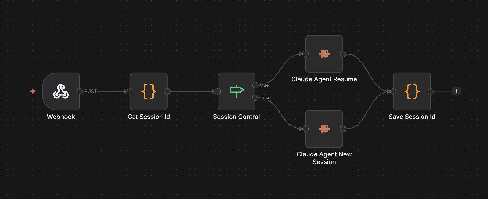
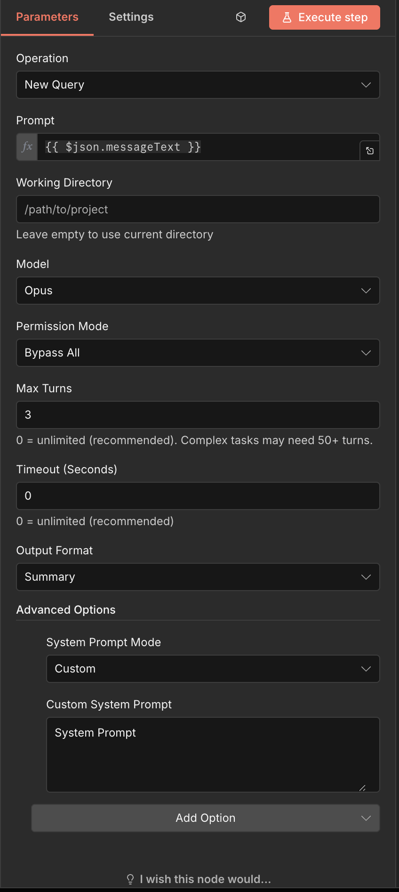

# n8n Claude Agent Node

An n8n community node integrating the Claude Agent SDK, bringing Claude AI into your automation workflows.

[](https://www.npmjs.com/package/@incursor/n8n-nodes-claudeagent)
[](https://opensource.org/licenses/MIT)

---

## Subscription Requirements

**This node is designed for Claude Pro or API subscription users**

- Uses your local Claude Code authentication - no additional API key configuration required
- No extra API charges - usage counts towards your subscription quota
- Supports all Claude models: Sonnet 4.5, Opus, Haiku

---

## Node Preview

### n8n Workflow Interface
<p align="center">
  
</p>

### Node Configuration Panel
<p align="center">
  
</p>

---

## Installation

### Prerequisites
- [Claude Code](https://claude.ai/code) installed and authenticated
- n8n version >= 0.200.0
- Node.js >= 20.15

```bash
git clone https://github.com/IncursorTech/n8n-nodes-claudeagent.git
cd n8n-nodes-claudeagent
npm run install-local
```

After installation, restart n8n and search for "Claude Agent" in the node list.

---

## Quick Start

1. **Add Node**
   Search for "Claude Agent" in your n8n workflow and drag it to the canvas

2. **Configure & Run**
   Select operation type, input prompt, and execute workflow

---

## Node Capabilities

### Session Operations

| Operation | Description | Typical Use Cases |
|-----------|-------------|-------------------|
| **New Query** | Start a new conversation | Independent tasks, code generation |
| **Continue** | Continue the most recent session | Multi-turn conversations, iterative refinement |
| **Resume** | Resume a specific session by ID | Return to a historical checkpoint |
| **Fork** | Fork a session from a specific point | Try different approaches from a checkpoint |

### Common Parameters

| Parameter | Type | Default | Description |
|-----------|------|---------|-------------|
| `prompt` | string | - | **Required** Instructions to send to Claude |
| `model` | select | `sonnet` | Model selection: Sonnet 4.5 / Opus / Haiku |
| `projectPath` | string | - | Working directory path (relative or absolute) |
| `outputFormat` | select | `summary` | Output format: Summary / Full / Text Only |
| `maxTurns` | number | 25 | Maximum conversation turns |
| `timeout` | number | 300 | Timeout duration (seconds) |

### Advanced Parameters

| Parameter | Type | Description |
|-----------|------|-------------|
| `systemPromptMode` | select | System prompt mode: Default / Append / Custom |
| `systemPrompt` | string | Custom system prompt text |
| `allowedTools` | array | Tool whitelist (takes priority) |
| `disallowedTools` | array | Tool blacklist |
| `permissionMode` | select | Permission mode: Bypass All / Accept Edits / Ask Always / Plan Mode |
| `additionalDirectories` | array | Additional directory access permissions |
| `fallbackModel` | select | Backup model when primary is overloaded |
| `maxThinkingTokens` | number | Maximum tokens for extended thinking |

### Controllable Tools

| Tool | Function | Risk Level |
|------|----------|------------|
| `Bash` | Execute terminal commands | High |
| `Edit` | Modify file contents | Medium |
| `Write` | Write new files | Medium |
| `Read` | Read files | Low |
| `Glob` | File pattern matching | Low |
| `Grep` | Search file contents | Low |
| `Task` | Launch sub-agent tasks | Medium |
| `TodoWrite` | Manage task lists | Low |
| `WebFetch` | Fetch web content | Low |
| `WebSearch` | Web search | Low |

> **Security Tip**: In production environments, use `allowedTools` to restrict high-risk tools (Bash, Edit, Write)

---

## Example Workflows

Check the `examples/` directory for practical workflow examples.

---

## Links

- [n8n Official Website](https://n8n.io/)
- [Claude Agent SDK](https://www.npmjs.com/package/@anthropic-ai/claude-agent-sdk)
- [Anthropic](https://www.anthropic.com/)
- [Report Issues](https://github.com/IncursorTech/n8n-nodes-claudeagent/issues)

---

## License

MIT License © 2025 Incursor Tech
